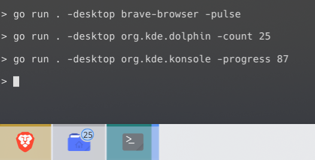
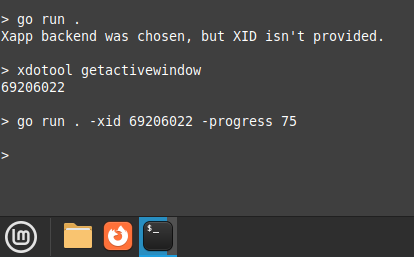

# Go Taskbar package

[](https://github.com/bibelin/taskbar/actions/workflows/go.yml) [](https://goreportcard.com/report/github.com/bibelin/taskbar) [](https://pkg.go.dev/bibelin/taskbar)

Set window hints like progress in taskbar on Linux.

```sh
go run example/taskbar-cli.go -desktop <desktop file name> -demo
```


Uses libunity Launcher API or Xapp window hints depending on desktop environment. No libs installed needed, Dbus calls and X11 properties are used instead.




